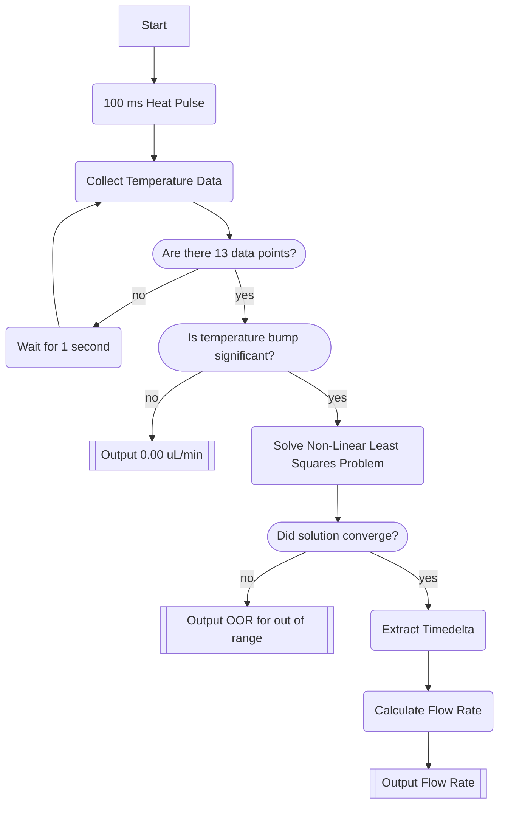

# Low Cost Flowsensor

## Project Layout
├── data
├── julia
├── pcb_v1
├── README.md
└── stm32

### data
Contains temperature measurement data for various sensor prototypes
**pcb_data**: Data from the pcb sensor
**prototype_2mm**: Sensor hacked together from Sparkfun Sensor Board. Distance between heater and sensor is aroudn 2mm
**prototype_5mm**: Sensor hacked together from Sparkfun Sensor Board. Distance between heater and sensor is aroudn 5mm
**misc**: Data from unknown prototypes

### julia
Contains Pluto notebooks which perform the data science analysis
**notebook.jl** Pluto notebook that analysis temperature pulses and extract the timedelta
**statistical_analysis.jl** Pluto notebook that compares extracted timedelta against flowrate. Also fits an exponential model for the flowrate-timedelta curve

### pcb_v1
Flowsensor PCB KiCAD Project

### stm32
The calibration and functional firmware
**data_collection**: Used to collect temperature data. Program this firmware and save the temperature data in .txt files. Then import the data into **statistical_analysis.jl** in julia and find the configuration parameters A, B and C. Finally, hardcode the constants in **functional_firmware**

**functional_firmware**: Outputs a flowrate every 15 seconds

