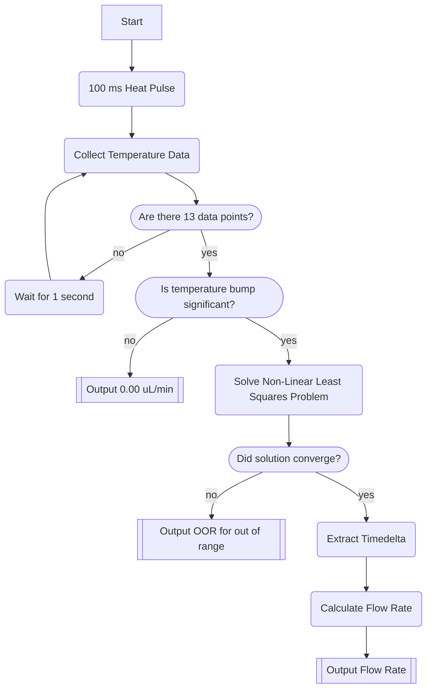

```mermaid
flowchart TD
    HeatPulse(100 ms Heat Pulse)
    DataCollection(Collect Temperature Data)
    Sleep(Wait for 1 second)
    ArrayFull([Are there 13 data points?])
    PassThreshold([Is temperature bump significant?])
    NoFlow[[Output 0.00 uL/min]]
    LM_Algo(Solve Non-Linear Least Squares Problem)
    ConvergenceCheck([Did solution converge?])
    OOR[[Output OOR for out of range]]
    Get_Timedelta(Extract Timedelta)
    Get_Flowrate(Calculate Flow Rate)
    Flowrate_Result[[Output Flow Rate]]
	Start --> HeatPulse
	HeatPulse --> DataCollection
	DataCollection --> ArrayFull
	ArrayFull -- no -->Sleep
	Sleep --> DataCollection
	ArrayFull -- yes -->PassThreshold
	PassThreshold -- no --> NoFlow
	PassThreshold -- yes --> LM_Algo
	LM_Algo --> ConvergenceCheck
	ConvergenceCheck -- no --> OOR
	ConvergenceCheck -- yes --> Get_Timedelta
	Get_Timedelta --> Get_Flowrate
	Get_Flowrate --> Flowrate_Result

```

